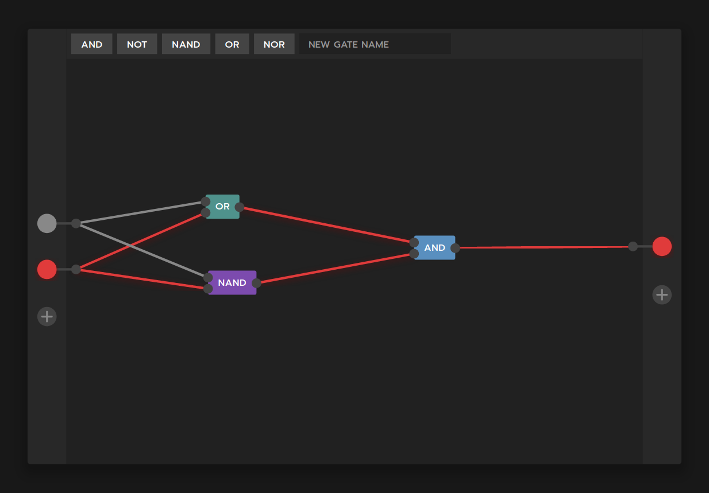

# Logik

Explore and play with logic gates in the web browser. Build anything from your simple custom NOR gate, to full fledged calculators.

## How to use

The app uses left and right click heavily. Use left click to move and drag new connections from the pins. Use right click to delete components and connections.

## Development

### Tech stack

The tech stack for this app is just Vue 3 with TypeScript and SCSS. The entire playground is based on SVG.

Vite is used as dev server.

### Running

To run this locally all you need is two commands

1. `yarn` (to install the dependencies)
1. `yarn dev` (to start the development server)
